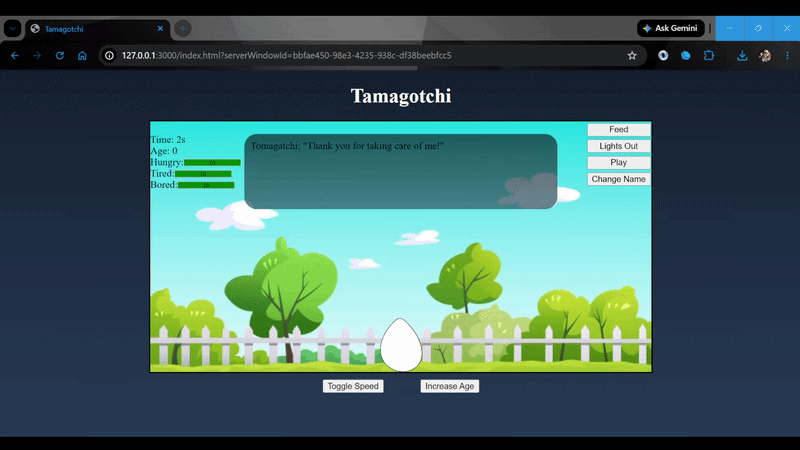
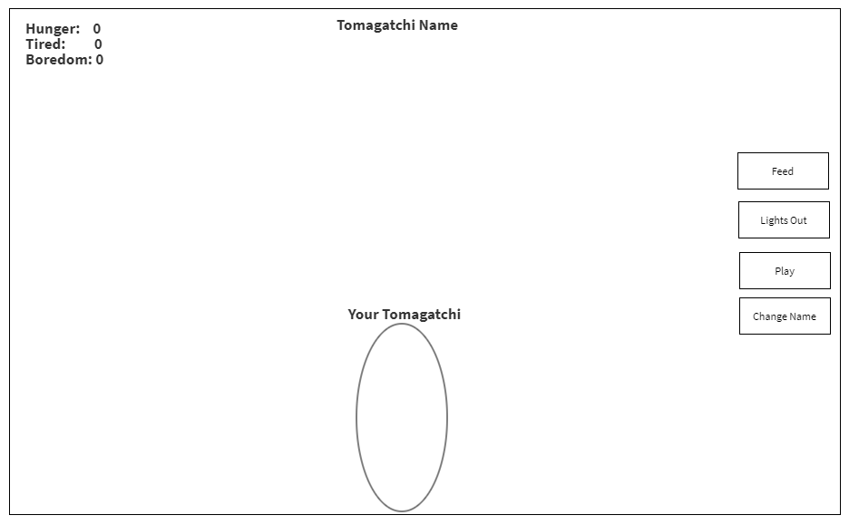

# Tamagotchi

## Demo



A web-based virtual pet game built with vanilla JavaScript, HTML, and CSS. Take care of your digital companion by managing its hunger, sleepiness, and boredom needs as it grows from an egg into a fully evolved pet.

## Features

- **Character Evolution System** - Watch your pet grow through 5 life stages (egg → baby → child → teen → adult)
- **Real-time Stats Tracking** - Monitor hunger, sleepiness, and boredom with visual progress bars
- **Dynamic Face Expressions** - Pet's face changes based on its mood and needs
- **Interactive Animations** - Walking animations and smooth CSS transitions
- **Name Customization** - Give your pet a unique name
- **Time-based Gameplay** - Stats decrease over time, requiring active care
- **Debug Tools** - Toggle game speed and manually increase age for testing

## Tech Stack

- **HTML5** - Semantic markup and structure
- **CSS3** - Animations, gradients, transitions, and responsive design
- **Vanilla JavaScript (ES6+)** - Classes, DOM manipulation, event handling, and game logic

## How to Play

1. **Start the Game** - Open `index.html` in your browser. Your pet begins as an egg.
2. **Name Your Pet** - Click "Change Name" to give your companion a name.
3. **Manage Stats** - Use the buttons to care for your pet:
   - **Feed** - Increases hunger stat
   - **Lights Out** - Increases sleepiness stat
   - **Play** - Increases boredom stat
4. **Watch It Grow** - As time passes, your pet will age and evolve through different forms
5. **Keep It Alive** - If any stat reaches 0, your pet will die. Keep all stats above 0!

### Debug Controls
- **Toggle Speed** - Switch between normal (1s) and fast (0.1s) game speed
- **Increase Age** - Manually advance your pet's age to see evolution stages

## Setup

1. Clone the repository:
```bash
git clone <repository-url>
```

2. Navigate to the project directory:
```bash
cd tamagotchi
```

3. Open `index.html` in your web browser

No build process or dependencies required - just open and play!

## Screenshots

### Wireframe


## Project Structure

```
tamagotchi/
├── images/
│   ├── faces/           # Character face expressions
│   ├── garden-background.jpg
│   └── wireframe.png
├── app.js               # Game logic and UI management
├── index.html           # Main HTML structure
├── main.css             # Styling and animations
└── README.md            # This file
```

## Development Notes

This project demonstrates:
- Object-oriented programming with ES6 classes
- DOM manipulation and event handling
- CSS animations and transitions
- Game state management
- Timer-based game loops
- Dynamic UI updates based on game state

---

Built with ❤️ using vanilla web technologies.